# 校园美食小程序

一款面向校园场景的美食点餐微信小程序，支持在线浏览菜单、下单支付、订单管理及后台数据统计等功能。

## 功能特性

### 用户端（微信小程序）

- 🎯 **首页展示** - 轮播图推荐、热门菜品浏览
- 📋 **分类浏览** - 八大分类（食堂一楼、食堂二楼、西门小吃街、南苑餐厅、北区食堂、东门烧烤、校外奶茶店、便利店）
- 🛒 **购物车** - 添加菜品、修改数量、结算下单
- 📦 **订单管理** - 查看订单列表、订单详情、取餐码
- 👤 **个人中心** - 用户信息、地址管理、消费记录

### 管理端（Web后台）

- 📊 **数据统计** - 订单数据概览
- 🍱 **菜品管理** - 添加、编辑、上下架菜品
- 📦 **订单处理** - 接单、完成订单
- 👥 **用户管理** - 用户列表查看
- 🏷️ **分类管理** - 菜品分类增删改查

## 项目截图

### 小程序端

<p align="center">
    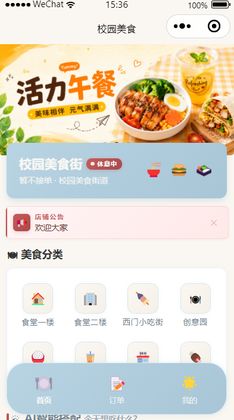
    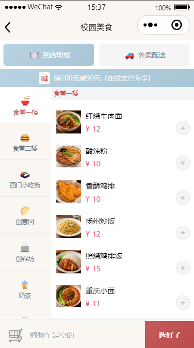
    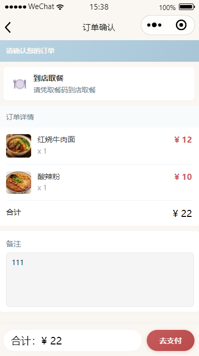
</p>

<p align="center">
    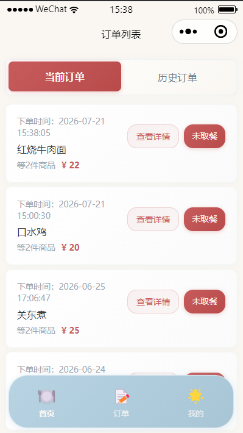
    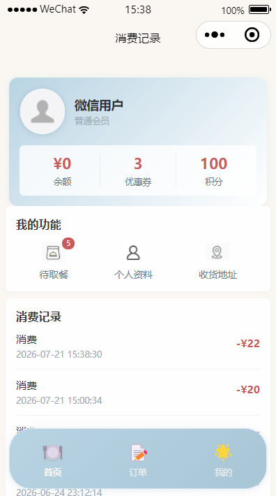
    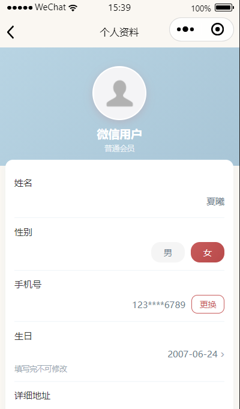
</p>

<p align="center">
    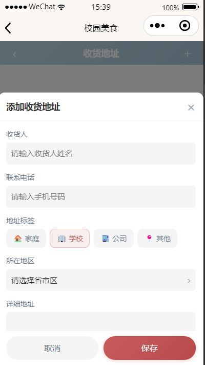
</p>

### 管理后台

<p align="center">
    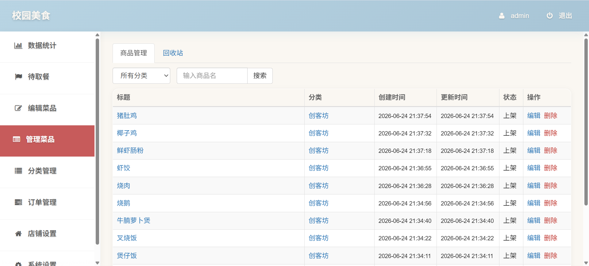
    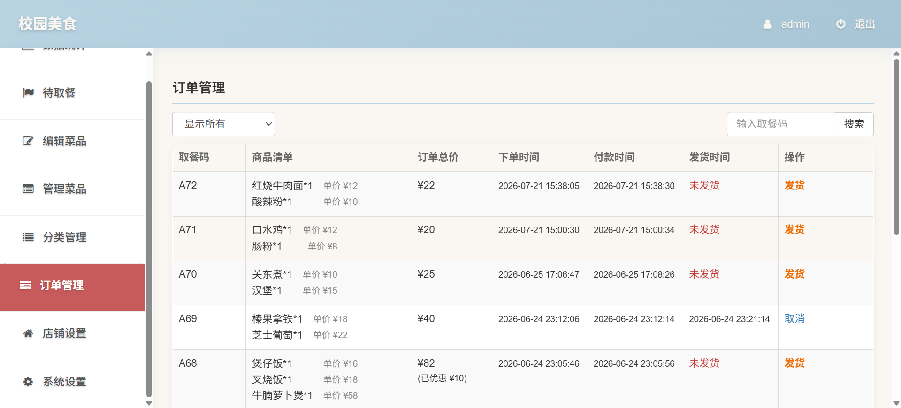
</p>

<p align="center">
    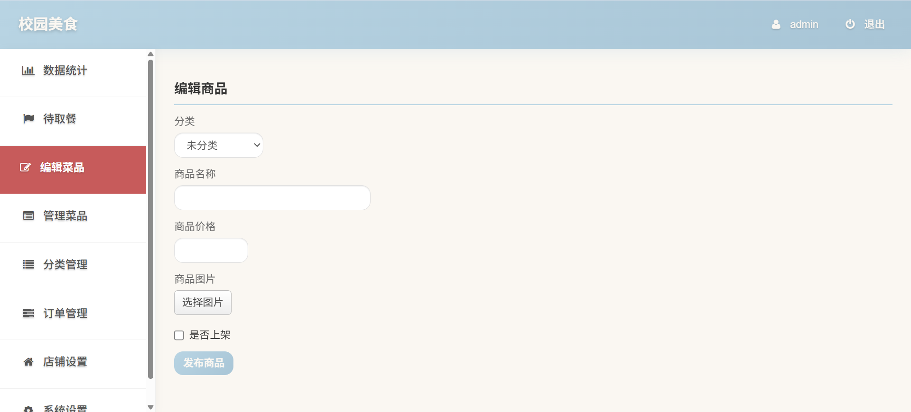
    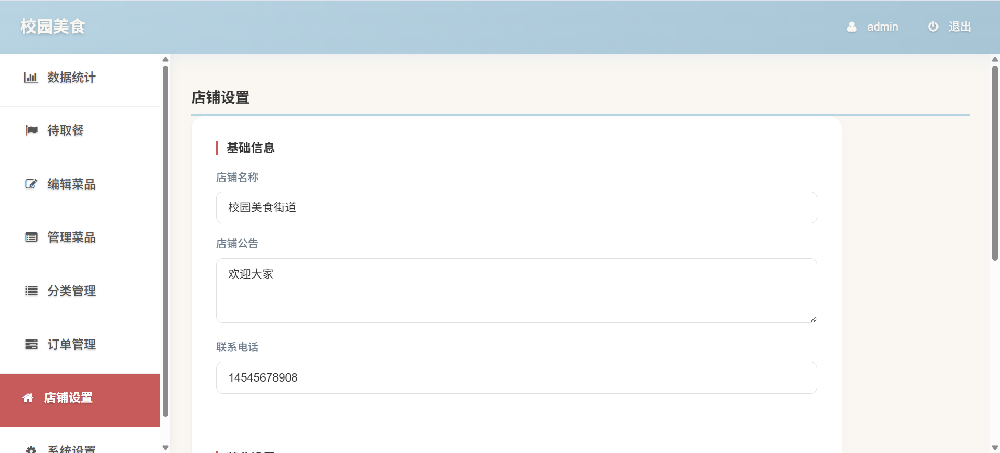
</p>

## 技术栈

| 模块 | 技术 |
|------|------|
| 前端 | 微信小程序原生开发 |
| 后端 | ThinkPHP 5.1 (PHP) |
| 数据库 | MySQL |
| 管理后台 | Bootstrap 3.4 |

## 项目结构

```
校园美食小程序/
├── 小程序/                    # 微信小程序前端代码
│   ├── pages/                 # 页面目录
│   │   ├── index/             # 首页
│   │   ├── list/              # 菜品列表页
│   │   ├── order/             # 订单相关页面
│   │   │   ├── checkout/      # 结算页
│   │   │   ├── detail/        # 订单详情页
│   │   │   ├── list/          # 订单列表页
│   │   │   └── pickup/        # 取餐页
│   │   └── record/            # 个人中心页面
│   │       ├── address/       # 地址管理
│   │       ├── profile/       # 用户信息
│   │       └── record/        # 消费记录
│   ├── images/                # 图片资源
│   ├── utils/                 # 工具函数
│   │   ├── config.js          # 接口配置
│   │   └── fetch.js           # 请求封装
│   ├── custom-tab-bar/        # 自定义TabBar
│   ├── app.js                 # 小程序入口
│   ├── app.json               # 全局配置
│   ├── app.wxss               # 全局样式
│   └── project.config.json    # 项目配置
└── 服务端/                    # ThinkPHP后端服务
    └── shop/                  # 项目根目录
        ├── application/       # 应用目录
        │   ├── admin/         # 管理后台模块
        │   ├── api/           # 小程序API模块
        │   └── index/         # 安装模块
        ├── config/            # 配置文件
        ├── public/            # 静态资源与入口
        ├── route/             # 路由配置
        ├── thinkphp/          # 框架核心
        ├── .env.sample        # 环境配置示例
        ├── install.sql        # 数据库初始化脚本
        └── composer.json      # Composer依赖
```

## 快速开始

### 环境要求

- PHP >= 5.6
- MySQL >= 5.5
- 微信开发者工具

### 服务端部署

1. **进入服务端目录**
   ```bash
   cd 服务端/shop
   ```

2. **安装依赖**
   ```bash
   composer install
   ```

3. **配置数据库**
   ```bash
   cp .env.sample .env
   ```
   编辑 `.env` 文件，填写数据库连接信息：
   ```
   [database]
   hostname = 127.0.0.1
   database = wxshop
   username = root
   password = your_password
   hostport = 3306
   prefix = pre_
   ```
   注意：数据库表前缀需与 `install.sql` 中的 `pre_` 保持一致

4. **导入数据库**
   ```bash
   mysql -u root -p wxshop < install.sql
   ```

5. **启动服务**
   ```bash
   php think run
   ```
   访问地址：http://localhost:8000

6. **配置微信小程序**
   在管理后台或数据库中配置微信小程序的 appid 和 appsecret：
   ```sql
   UPDATE pre_setting SET value='your_appid' WHERE name='appid';
   UPDATE pre_setting SET value='your_appsecret' WHERE name='appsecret';
   ```

### 小程序端开发

1. **打开项目**
   使用微信开发者工具打开 `小程序/` 目录

2. **配置接口地址**
   编辑 `小程序/utils/fetch.js`，修改接口地址为服务端地址：
   ```javascript
   url: 'http://localhost:8081/api/'
   ```

3. **配置项目**
   在微信开发者工具中配置小程序 AppID

### 管理后台

- 访问地址：http://localhost:8000/admin
- 初始管理员账号需在数据库中手动创建

## 数据库结构

| 表名 | 说明 |
|------|------|
| pre_setting | 系统设置（appid、appsecret、促销活动、轮播图等） |
| pre_admin | 管理员表 |
| pre_user | 用户表（openid、余额） |
| pre_category | 菜品分类表（8个默认分类） |
| pre_food | 菜品表（名称、价格、图片、状态） |
| pre_order | 订单表（用户、价格、支付状态、取餐状态） |
| pre_order_food | 订单菜品关联表 |

## 接口说明

小程序端通过 HTTP 请求与后端 API 通信，主要接口包括：

- `user/setting` - 检查登录状态
- `user/login` - 用户登录（微信授权）
- `food/index` - 获取轮播图和广告图
- `food/list2` - 获取菜品分类及菜品列表
- `food/order` - 创建订单或获取订单详情
- `food/pay` - 支付订单
- `food/orderlist` - 获取订单列表
- `food/record` - 获取消费记录

## 注意事项

1. 确保服务端和小程序端的接口地址一致
2. 使用真实的微信小程序 AppID 进行测试
3. 数据库表前缀需与配置文件一致
4. 图片资源需放置在 `服务端/shop/public/static/uploads/images/` 目录

## License

MIT License
